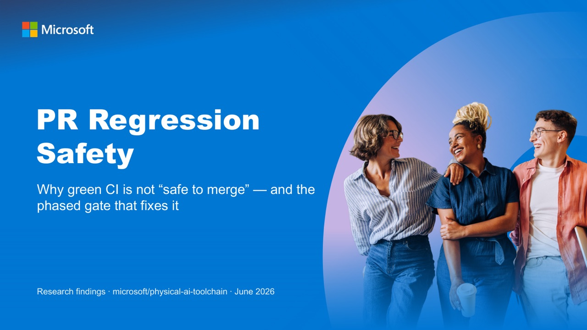

<!-- markdownlint-disable-file -->
# PR Regression Safety

A short, narrated talk arguing that **a green CI check is not the same as "safe to merge"** in `microsoft/physical-ai-toolchain` — and proposing a phased gate that closes the gap.

The repository's test pipeline runs CPU-only, but the regressions that actually hurt are runtime-, GPU-, and interpreter-specific: CUDA/torch ABI breaks, Isaac Lab's Python-3.11 runtime, lockfile drift. Eight such failures were reconstructed from the project's own history — **green CI caught none of them**. The talk lays out four fixes that ship now for ~$0 and one funded GPU capstone, each mapped to the incidents it would have stopped.

## ▶️ Watch (≈26 min)

**[▶ Play the narrated video](presentation.mp4)** (~60 MB) — opens a player on GitHub. Prefer the slides? See the silent [`deck/presentation.pdf`](deck/presentation.pdf).

> [!NOTE]
> GitHub does not embed an inline player for repo-committed video, so the image above links to the file's page, where GitHub shows a player. Click it, or use the links below it.

## 🗺️ The argument in one line

> Green CPU CI is blind to the costly regression classes → add risk-aware dependency intake, a GPU-free smoke gate that runs inside the real runtime image, safe automation, and — when funded — a gated GPU end-to-end run. Each phase stands alone; adopt incrementally.

53 slides (34 core + 19 appendix). The structure, claims, and narration reflect a 7-lens critique pass. For the talk's reasoning watch the video; to **act on it**, the plan below is self-contained.

## 🔥 The failure map

Eight regressions/test-integrity gaps were reconstructed from the repo's own history; green CI caught zero. Each row maps an incident to the phase that would catch it — the spine of the plan.

| Incident | Today | P0 group | P1 smoke | P2 auto | P3 GPU |
| --- | :---: | :---: | :---: | :---: | :---: |
| **#809** — RL lock resolved for Py 3.12 vs the 3.11 runtime → 4 cascading ABI failures | ✗ | – | ✓ | – | – |
| **#790** — LeRobot needs Py ≥ 3.12 vs an OSMO 3.11 runtime | ✗ | – | ∼ | – | – |
| **#958** — torch 2.10→2.11 bump pulled CUDA 13 bindings → libcudart break (live desync today) | ✗ | ∼ | ∼ | – | ✓ |
| **#691 / #547** — path-filter bugs silently disabled fuzz / data-pipeline / training tests for weeks | ✗ | – | ✓ | – | – |
| **churn** — starlette 0.52→1.0→1.3 in ~11 days; ~24 dependency PRs/week | ✗ | ✓ | – | ✓ | – |

✓ caught/prevented · ∼ partial (reduces risk) · – n/a · ✗ missed today. **#958 splits**: the dependency-resolution half is caught early (∼); the device-ABI half needs real hardware (Phase 3).

## 🪜 The phased plan

Phases 0–2 and the Renovate spike run on ordinary Actions runners (no Azure, ~$0). Only Phase 3 needs funded GPU compute. Each block lists the problem, an external precedent, and the concrete change.

### Phase 0 — Risk-aware dependency intake · config only · ~$0 · hours

- **Problem.** 21 ecosystem blocks (9 uv · 3 npm · 4 Terraform · 3 Docker · 1 Go · 1 Actions), every group a wildcard catch-all → a harmless patch and a CUDA-breaking major are batched alike. ~7 ignore-pins added reactively after breakages; no stability window.
- **Precedent.** `vercel/ai` splits production vs development deps; `huggingface/transformers` adds a 7-day cooldown.
- **Do this** in `.github/dependabot.yml`: split update-types (batch patch+minor into one PR, isolate majors for review), add a 7-day `cooldown`, and keep security updates **ungrouped and fast-tracked** (never batched).
- **Catches.** Churn and review noise; makes the dangerous bump visible.

### Phase 1 — GPU-free smoke gate · ~$0 · days

- **Problem.** All test CI is CPU-only `ubuntu-latest`; the interpreter/ABI breaks fail on the real runtime image CI never loads. Path-filter bugs (#691, #547) reported green while testing nothing.
- **Two depths.**
  - **Tier 0 (1a)** — venv, seconds, **every PR**: `uv lock --check`, import + `--help`, YAML/schema validate. Cheap. *Caveat:* it installs CPU wheels, so it checks a different graph than the production CUDA one.
  - **Tier 1 (1b)** — inside the **real runtime image**, minutes, **path-gated**: `docker run` the actual image, reinstall the PR's lock as prod does, import on the real interpreter (Isaac = Python 3.11). Deterministically catches **#809** (and probably **#790**). Bounded by disk, not capability.
- **Proven.** Run this session inside `nvcr.io/nvidia/isaac-lab:2.3.2` (Python 3.11.13): a dependency requiring `>=3.12` is rejected at install, on CPU — the exact shape of #809.
- **Do this.** Add `smoke-cpu.yml` (Tier 0 every PR + Tier 1 path-gated) behind **one fail-safe required check** that can never be silently skipped. Small enabling refactor: move `AppLauncher` into `main()` in `training/rl/scripts/rsl_rl/train.py` (with acceptance criteria) so the module imports on CPU.
- **Limit (honest).** Catches install/import/interpreter drift. It **cannot** prove CUDA, Vulkan, MIG, or a real training loop — that is Phase 3's job.

### Phase 2 — Safe automation · ~$0 · days

- **Problem.** Dependabot cannot merge its own PRs, so every trivial patch waits on a click (~24 PRs/week). The advisory agent can fire before CI finishes, spending tokens on doomed PRs.
- **Precedent.** `NVIDIA-NeMo/NeMo` runs a gated agentic loop: the agent posts one plan comment and must not push; a human approves; a separate job verifies team membership, then pushes and re-runs CI.
- **Do this.** (a) Re-trigger the read-only gh-aw reviewer on `workflow_run` (skip-if-check-failing, one updating comment; for high-risk bumps open a single issue assigned to the Copilot coding agent). (b) Auto-merge **patch-only**, scoped to dev/docs/actions, no runtime/GPU packages, never security, required checks green, with an instant-revert playbook.
- **Catches.** Reviewer toil; routes risk to a human-gated agent instead of straight to merge.

### Phase 3 — Gated GPU end-to-end (the capstone) · funded

- **Problem.** Nothing exercises the GPU runtime, so "safe to merge" can't be asserted. Only real hardware catches CUDA/driver/Vulkan/MIG breaks and #958's device-ABI half.
- **Precedent.** NeMo gates every GPU job behind a GitHub Environment + queue and mirrors fork PRs to internal branches (no `pull_request_target`).
- **Do this — two jobs** so untrusted PR code never touches the token-bearing runner: **Job A** on `pull_request` (read-only, no secrets) renders a constrained job spec; **Job B**, after an approving review, checks out the **base** workflow, validates the spec against an allowlist, mints OIDC via an Environment gate, and submits. PR code runs in the GPU pool, not on the runner.
- **Cost (illustrative; confidence low on exact $).** ~$3–8 GPU-hour × ~0.3–1.0 hr/run; ~5–15 approved runs/week (not per-PR); 60-min timeout, concurrency 1, monthly cap. Scenarios: low ≈ $60/mo · expected ≈ $150/mo · spike ≈ $400/mo. Idle ≈ $0 (scale-from-zero).

### Spike — Renovate (parallel, ~$0)

Dependabot groups are per-ecosystem (still 4+ PRs/cycle). Renovate's one edge here is **cross-ecosystem grouping** (one config across npm + uv + Terraform + Go). *Not* the gap: uv support (Dependabot has it; this repo uses it). Run a time-boxed spike via `renovatebot/github-action` (no Mend App approval); switch only if PR volume drops without losing the security fast lane.

## ✅ Decision requested

Concrete approvals a reviewer can give today:

- [ ] **Phase 0** — approve the `dependabot.yml` grouping + cooldown change.
- [ ] **Phase 1a** — approve the Tier-0 required check on every PR.
- [ ] **Phase 1b** — approve a Tier-1 real-image smoke spike with a runtime cap.
- [ ] **Phase 2** — approve a patch-only auto-merge pilot (dev/docs/actions) + CI-triggered agentic triage.
- [ ] **Spike** — approve a time-boxed Renovate evaluation via `github-action`.
- [ ] **Phase 3** — defer pending a GPU budget number; the design is settled.
- [ ] **Now, out of band** — fix the live torch 2.10 / 2.11 desync (`pytest-training.yml` force-installs 2.11 while the lock pins 2.10). This is a bug, not a decision.

Suggested first thread: Phase 0 + Phase 1a (both config-level, highest signal-to-effort). No prior backlog issue exists, so filing one is non-duplicative.

## 🤔 Anticipated objections

| Objection | Response |
| --- | --- |
| Won't auto-merge cause incidents? | Patch-only, dev/docs/actions, no runtime/GPU packages, no security batching, required checks green, instant revert. |
| Why not just pin Python everywhere? | Necessary but insufficient — pins don't exercise real-image installs, transitive ABI selection, or CUDA/MIG execution. |
| Why not replace Dependabot with Renovate now? | Native grouping covers most of it; Renovate is a minority tool in Microsoft OSS. Spike first, decide on merits. |
| Why not run GPU on every PR? | Cost, plus running fork code on a GPU runner. Gate + submit-and-poll instead. |
| Is the emulated-amd64 prototype representative? | Enough to prove the interpreter/marker class; a native amd64 runner would harden final confidence. |

## 📂 What's inside

- [`presentation.mp4`](presentation.mp4) — the narrated video (~26 min, ~60 MB).
- [`deck/presentation.pdf`](deck/presentation.pdf) — the slides as a lightweight PDF.
- [`narration-script.md`](narration-script.md) — the full spoken script, one section per slide.
- [`deck.yaml`](deck.yaml) — every slide's source in one readable file (for clean review diffs).
- [`BUILD.md`](BUILD.md) — how to regenerate the slides, PDF, and video from source.
- [`PRESENTATION_SPEC.md`](PRESENTATION_SPEC.md) — the durable requirements and the applied-critique record.

The underlying research and the 7-lens critique are linked from [BUILD.md](BUILD.md#-research-and-critique).
